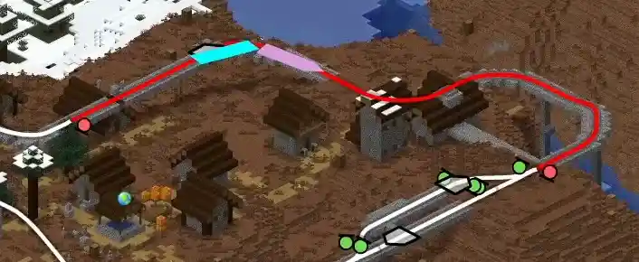

# DynMap Trains

Dynmap integration for [Create Track Map](https://modrinth.com/mod/create-track-map).



## Features

- Same as CTM's frontend; near-realtime updates, configurable colors, etc.
- Works surprisingly good in 3D view
- Smoothly moving trains

## Requirements

- [Create Track Map](https://modrinth.com/mod/create-track-map) 
  - And it's dependencies
- [Dynmap](https://modrinth.com/plugin/dynmap)

## Installation

1. Download [`trains.js`](https://github.com/Zhincore/dynmap-trains/releases/latest/download/trains.js) from the [GitHub releases page](https://github.com/Zhincore/dynmap-trains/releases/latest).
2. Drop the `trains.js` into `<your server path>/dynmap/web/js/`.
3. Add these lines in `dynmap/configuration.txt` under the `components:` section:
    ```yaml
    - class: org.dynmap.ClientComponent
      type: trains
      baseUrl: "https://trains.example.com"
    ```
4. Restart the server and done! But you should probably [configure it](#configuration) first.

## Configuration

In addition to the CTM's configuration file, you can configure the appearence and behaviour of this script on DynMap.

Bellow is an example snippet from DynMap's `configuration.txt` with all available options and their default values. 
You can specify just the options you want to change and the rest will keep their default.

Usually you only need to set `baseUrl`. It should be the URL under which your CTM is available from outside, since this addon works in browser, it cannot be `localhost`. 

```yaml
components:
  - class: org.dynmap.ClientComponent
    type: trains
    # Base url of CTM server. "" will try the current address (which is for example `localhost:8123/api/trains`), you can make this work using a reverse proxy (like Nginx).
    # If specified, it should be a publicly available address.
    # The default address of CTM is `http://localhost:3876` (which will NOT work on the internet, just saying)
    baseUrl: ""
    # Dynmap world name to CTM world name mapping 
    worlds:
      world: "minecraft:overworld"
      DIM-1: "minecraft:the_nether"
      DIM1:  "minecraft:the_end"
    # Configuration for each layer
    #   `hidden` - Whether or not should the layer be hidden by default
    #   `label` - The label of the layer to show in the UI
    layers: 
      trains:
        hidden: false
        label: Trains
      blocks:
        hidden: false
        label: Train Tracks
      signals:
        hidden: false
        label: Train Signals
      stations:
        hidden: false
        label: Train Stations
      portals:
        hidden: false
        label: Train Portals
    # Additional texts used in the UI 
    labels: 
      # Tooltip for portal marker 
      portal: "Portal to "
      # Tooltip for station marker 
      station: Station
      # Tooltip whether the station is assembling 
      assembling: Assembling
      # Tooltip for train marker 
      train: Train
      # Owner of train 
      owner: Owner
    # Width of the rectangles representing trains (in blocks) 
    trainWidth: 3
    # Width of the lines representing tracks 
    trackWidth: 0.75
    # Width of the outline around the track lines 
    trackOutline: 1
    # Whether or not should the track outline visually separate track segments 
    trackSeparationOutline: true
```


## Development

Follow these steps to build the project yourself (you need PNPM for that):

1. Run `pnpm i` to install the dependencies
2. Run `pnpm build` to transpile all the TypeScript files into a single file `build/trains.js`.

You can run `pnpm build --watch` to automatically rebuild the file on changes.

In my testing server I have a symbolic link in `dynmap/web/js/` that points to the `build/trains.js`.
